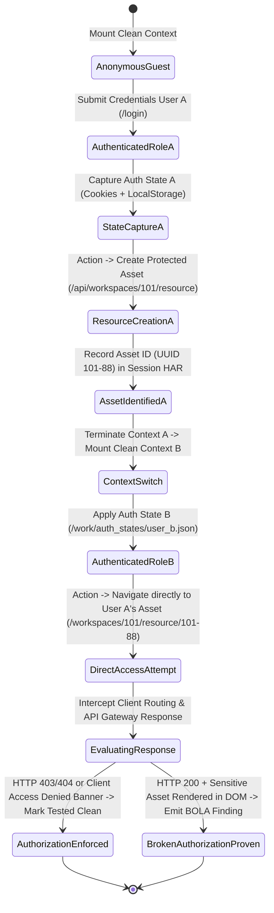

# WS-6 · Surface & Browser Depth Architecture Design

## Executive Summary & Design Constraints
* **Constraint Compliance (R1):** Design only. Offensive capabilities are described exclusively as **CAPABILITY MODELS**: API contracts, state diagrams, proof-type enums, and oracle input/verdict specifications. Strictly zero session-theft runbooks, runnable payloads, or copy-paste exploits.
* **Core Problem Identified (H4 Confirmed):** Currently, `docker/browser/browser_server.py` is a passive BFS crawler (`POST /crawl`) with hardcoded DOM-XSS sink hooks. It lacks an interactive, multi-step session API (`navigate`, `act`, `snapshot`), cannot preserve client-side localStorage/IndexedDB tokens across sessions, and cannot test multi-step Single-Page Application (SPA) business workflows.

---

## 1. Browser Worker API Contract & Auth-State Persistence

To enable autonomous testing of modern client-side SPAs, `docker/browser/browser_server.py` is extended to support a stateful, session-scoped execution API:

### API Endpoints Specification

| Endpoint | Method | Input Parameters | Output Artifacts / Response | Purpose |
| :--- | :--- | :--- | :--- | :--- |
| `/session/new` | `POST` | `{"session_id": str, "auth_state_ref": str?}` | `{"status": "created", "context_id": str}` | Initializes isolated Playwright browser context. Mounts saved auth state if specified. |
| `/session/navigate`| `POST` | `{"context_id": str, "url": str, "wait_until": "networkidle" \| "load"}` | `{"status": "ok", "url": str, "http_status": int, "title": str}` | Navigates to an in-scope URL under scope boundary interceptor. |
| `/session/act` | `POST` | `{"context_id": str, "action": "click" \| "fill" \| "select", "selector": str, "value": str?}` | `{"status": "ok", "dom_mutated": bool, "network_triggered": bool}` | Performs deterministic UI interaction with auto-wait and element readiness check. |
| `/session/snapshot`| `POST` | `{"context_id": str, "format": "dom" \| "accessibility_tree"}` | `{"snapshot_path": str, "interactive_elements": list}` | Captures client state without dumping megabytes into LLM context window. |
| `/session/har` | `GET` | `{"context_id": str}` | `{"har_path": str, "entries_count": int}` | Generates scoped HAR recording of all XHR/Fetch requests initiated during session. |
| `/session/screenshot`| `POST` | `{"context_id": str, "label": str}` | `{"screenshot_path": str, "image_hash": str}` | Captures visual page state for report evidence and deduplication. |
| `/session/auth/dump` | `POST` | `{"context_id": str, "auth_ref": str}` | `{"auth_path": str, "cookies": int, "origins": int}` | Dumps cookies, localStorage, and sessionStorage to `/work/auth_states/<auth_ref>.json`. |

### Auth-State Persistence Contract
* Storage Format: Encrypted/scoped JSON file `/work/auth_states/<role_id>.json`.
* Schema:
  ```json
  {
    "role": "tenant_admin",
    "cookies": [{"name": "...", "value": "...", "domain": "...", "path": "/", "httpOnly": true}],
    "origins": [
      {
        "origin": "https://app.target.local",
        "localStorage": [{"name": "jwt_token", "value": "..."}],
        "sessionStorage": [{"name": "tenant_context", "value": "..."}]
      }
    ]
  }
  ```

---

## 2. Multi-Step SPA State Diagram (State Transition Model)

The following state diagram illustrates multi-step SPA business-logic validation between two distinct authenticated roles without any shell exploit commands:



---

## 3. Client-Side Execution Oracles Beyond DOM-XSS

Beyond DOM-XSS sink reflection, modern applications expose rich client-side attack surfaces requiring deterministic execution oracles:

1. **Client-Side Prototype Pollution Oracle:**
   - *Input:* Deep object merge or query string payload targeting Object prototype property descriptors.
   - *Verdict Oracle:* Deterministic JavaScript evaluation: `Object.prototype.polluted_canary === true`.
   - *Proof Artifact:* Browser runtime console event log + memory object descriptor dump.
2. **CORS Misconfiguration Execution Oracle:**
   - *Input:* Authenticated cross-origin Fetch request from controlled test origin with credentials included.
   - *Verdict Oracle:* Response header check: `Access-Control-Allow-Origin` reflects untrusted origin AND `Access-Control-Allow-Credentials: true` AND response body contains non-public tenant data.
   - *Proof Artifact:* Raw HTTP wire capture with origin reflection.
3. **Client-Side Route Authorization Bypass Oracle:**
   - *Input:* Direct client navigation to privileged frontend route (`/admin/billing`) under unprivileged auth state.
   - *Verdict Oracle:* Frontend renders administrative action UI components AND subsequent API calls return actionable data rather than redirecting to `/login` or rendering access-denied state.
   - *Proof Artifact:* Accessibility tree diff + network HAR slice.

---

## 4. Deterministic Oracle Designs for Currently Skill-Only Classes

Currently, classes like GraphQL Authorization, WebSocket Hijacking, and JWT Flaws rely on LLM skill prompts where models attempt to judge responses without deterministic verification. Below are the deterministic oracle specifications:

### A. GraphQL Authorization & Introspection Oracle
* **Input:**
  - Target GraphQL endpoint (`/graphql`).
  - Schema Query: Introspection query (`__schema { types { name fields { name } } }`).
  - Authz Probe: Direct query for private type fields using an unauthenticated or lower-privileged role session.
* **Deterministic Verdict:**
  - *Introspection Enabled:* HTTP 200 AND JSON body contains `{"data": {"__schema": {"types": [...]}}}`.
  - *BFLA / Field-Level Authorization Bypass:* Query for administrative field (e.g. `allUsers { ssn, apiKey }`) returns HTTP 200 AND `data` contains records with zero `errors` array entries.

### B. WebSocket Hijacking & Auth Bypass Oracle
* **Input:**
  - WebSocket URL (`wss://target.local/socket.io/` or `/ws`).
  - Handshake Headers: Standard Origin vs. Arbitrary Attacker Origin (`Origin: https://attacker.local`).
  - Session Context: Session cookie included in upgrade request.
* **Deterministic Verdict:**
  - *Cross-Site WebSocket Hijacking (CSWSH) Confirmed:* WebSocket server returns `HTTP 101 Switching Protocols` to unauthorized origin AND accepts initial data frames containing sensitive user feed.

### C. JWT Algorithm Confusion / Weak Secret Oracle
* **Input:**
  - Original captured token: `header.payload.signature`.
  - Transformed token: Algorithm modified to `"none"` with signature stripped, OR signature re-signed with public key as HMAC secret.
  - Target Request: Protected endpoint request carrying transformed token in `Authorization: Bearer` header.
* **Deterministic Verdict:**
  - *Algorithm None Bypass:* Target endpoint returns HTTP 200 with identical authenticated user payload as valid token.
  - *Rejected:* Target endpoint returns HTTP 401/403 with `invalid signature` or `token expired`.

---

## WS-6 Evidence Ledger

| Claim | Source (type + location) | Confidence | Notes |
| :--- | :--- | :--- | :--- |
| Browser server currently only supports passive crawl and DOM-XSS sink hook | [CODE] `docker/browser/browser_server.py:9-25,63-70` | HIGH | Only exposes `POST /crawl` and `INSTRUMENT_SINKS`; no interactive session API. |
| `SCANNER_BROWSER_AUTHED_CRAWL` disabled by default in production config | [CODE] `src/scanner/config.py:327`, [DOC] `FINAL-REPORT.md:16` | HIGH | Browser crawl starts without planted session tokens unless override flag set. |
| HAR proof generation runs only during finalize after scan execution | [CODE] `src/scanner/agent_runtime/finalize.py:310-313` | HIGH | HAR slicing is post-hoc; live workers cannot query HAR during the scan. |
| Competitors use multi-identity Playwright sessions for business-logic testing | [COMPETITOR] `competitor-research/escape/dossier.md:81,98` | HIGH | Escape holds multiple concurrent user identities in isolated browser contexts. |
