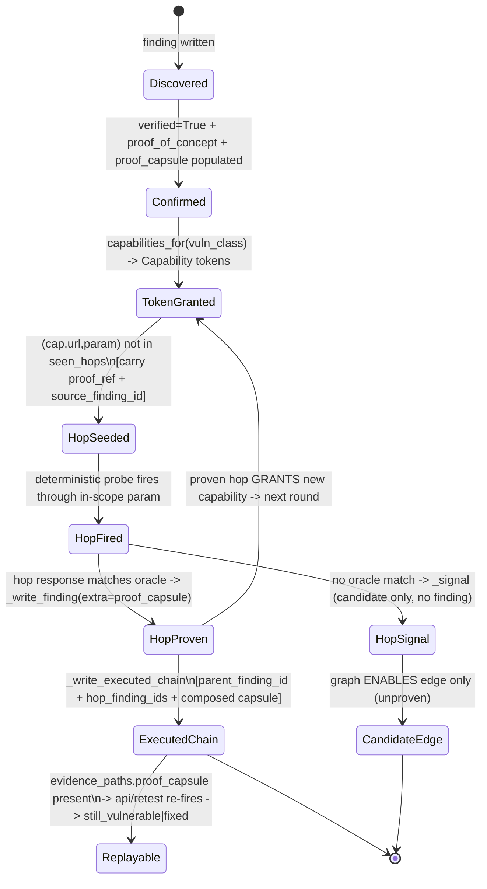

I have all the grounding I need. Key discovery that shapes the design: `_write_finding(..., extra=)` (exploit_floor.py:2394) already routes a dict into `evidence_paths`, and the retest replay contract already reads `evidence_paths.proof_capsule = {method, request, response_excerpt}` (retest.py:58-92). So proof-artifact carry and replayability are a **wiring** delta on existing plumbing, not a new subsystem. Writing the section.

---

# WS-4 — Chain State-Machine Design (Abhedi Red)

`feat/alpha-observability` @ `f75608f` · design-only · every delta flag-gated, default-OFF (D4)

## 1. H3 verdict + current-state recap

**H3 verdict: REFUTED — a confirmed primitive's capability token does NOT carry a proof *artifact* into hop N+1.** The chain substrate is graph-inference + location-only re-probing; the proof rides a node as a report *decoration*, never as an input to the next hop, and the executed-chain finding is prose with no parent linkage, no capsule, no replay. Confidence **HIGH** (inherited from audit, spot-verified below).

Two-line recap: (a) The **GRAPH** (`chain/service.py`, default-ON `scanner_chain_synthesis=True` — [CODE] config.py:149) walks the static `GRANTS`/`ENABLES` table and emits the report's "Candidate / reachability (not executed)" bucket. (b) The **FLOOR** (`chain/floor.py`, default-OFF `SCANNER_ENGINE_CHAIN_FLOOR=0`) is the only code that fires a real hop N+1 — but it carries only `(url, param)` ([CODE] floor.py:190-201, 432) into a freshly self-re-proving probe, and its executed-chain finding writes no `evidence_paths`, no parent `finding_id`, no capsule ([CODE] floor.py:204-228). No proof-type enum exists (only `Capability` StrEnum — [CODE] capabilities.py:22-33).

**Load-bearing fact that makes the whole delta cheap (verified this pass):** the sink helper the floor already calls, `_write_finding(..., extra: dict|None)`, writes `extra` straight into the finding's `evidence_paths` ([CODE] exploit_floor.py:2394-2410) — and the live per-finding replay endpoint reads exactly `evidence_paths.proof_capsule = {method, request, response_excerpt}` ([CODE] retest.py:58-92). **The carry channel and the replay contract already exist and are wired; the floor simply passes `extra=None` today.** So this design is "populate a dict that's already threaded," not "build a proof system."

## 2. Chain state machine

### 2.1 How a CONFIRMED primitive grants a capability token

Unchanged from today and correct: a finding reaches `verified=True` with a `proof_of_concept` → `_read_confirmed()` admits it ([CODE] floor.py:426) → `capabilities_for(vuln_class)` mints the granted `Capability` tokens from the static `GRANTS` table ([CODE] capabilities.py:38-72). **Delta is not in the grant; it is in what the token *carries*.**

### 2.2 Token schema (the delta)

Today the "token" is a bare `Capability` enum value threaded through `seen_hops` keyed `(cap.value, url, param)` ([CODE] floor.py:437). Proposed enriched token — an in-memory dataclass carried alongside the hop call, and serialized into the capsule/edge on a proven hop:

```
CapabilityToken:
  capability:      Capability            # existing enum (capabilities.py:22)
  source_finding_id: uuid | None         # the CONFIRMED primitive that granted it
  proof_type:      ProofType             # NEW enum, §3.2
  proof_ref:       ProofCapsuleRef       # {method, request, response_excerpt(redacted marker)}
  location:        (url, param)          # what floor already carries today
```

`proof_ref` is not a copy of the payload — it is the same `{method, request, response_excerpt}` shape the retest endpoint already consumes, with `response_excerpt` redacted via the existing `redact()` ([CODE] evidence.py:59-60). Capability label enum = the existing `Capability` (11 members — [CODE] capabilities.py:22-33); no new capability values are proposed (D6: no new taxonomy without evidence).

### 2.3 How it is persisted (name the table/field)

Three existing homes, no new table:

- **Per-hop proven finding** → `Finding.evidence_paths.proof_capsule` (JSONB) via `_write_finding(extra={"proof_capsule": {...}, "chained_from": <source_finding_id>})` ([CODE] exploit_floor.py:2409-2410 already supports `extra`). This is the table `api/retest.py` replays from — populating it makes chain hops replayable **for free**.
- **Executed-chain finding** → same `Finding` row; add `parent_finding_id` + `hop_finding_ids[]` into its `evidence_paths` (the `_write_executed_chain` row dict at [CODE] floor.py:220-228 currently omits `evidence_paths` entirely — add the key).
- **Graph edge** → `ChainEdge` already has real FKs `from_node`/`to_node` ([CODE] tenant.py:331-332). `ChainNode.finding_id` is nullable/no-FK and often `None` ([CODE] tenant.py:306, service.py:183) — the delta makes the **edge** carry `proof_type` + `proof_capsule_ref` so a proven edge is distinguishable from a graph-inferred candidate edge (see gap in §6-T4).

### 2.4 How hop N+1 receives it

Two receivers, because the platform has an LLM-free path and an LLM path:

- **Deterministic floor (LLM-free):** hop N+1 already receives `location`; the delta additionally seeds the hop with the parent `proof_ref.response_excerpt` as a **negative-control baseline** — the hop records "parent marker present before / absent in unrelated control" so the composed capsule carries a negative control (competitor buyer-standard). No prompt involved.
- **Escalation re-loop (LLM path):** when a `HIGH_IMPACT` capability arrives, `newly_high_impact` reopens ledger cells ([CODE] escalation.py:37-50; service.py:249-254). The delta attaches `chained_from={source_finding_id, capability, proof_ref}` to the reopened cell's context so the **worker prompt** reads "you already hold `CREDENTIAL`, proved by finding <id> at <loc> — attack the classes it unlocks" instead of re-discovering blind. This is the only place a token reaches a worker prompt; today it reaches nothing.

### 2.5 State machine (text/mermaid)



The single structural change vs. today: the `HopProven -> ExecutedChain -> Replayable` arc currently terminates at a prose string with no capsule, so `Replayable` is unreachable and the "Executed (proven end-to-end)" report bucket is structurally empty in stock deploy ([CODE] floor.py:220-228; report bucket reporting/service.py:528).

## 3. Parent-finding linkage + proof-type enum + replay contract

### 3.1 Finding→finding edge

Add to every chain-hop finding and to the executed-chain finding: `evidence_paths.chained_from = <source finding_id>` (single parent) and, on the executed-chain row, `evidence_paths.hop_finding_ids = [<proven hop finding_id>, …]`. Rendering deep-links each hop to its source finding row (the report's `title_by_fid` join already exists — [CODE] reporting/service.py:96). `ChainEdge` FKs stay the graph's node→node linkage; the finding→finding linkage lives in `evidence_paths` because chain findings are findings.jsonl rows first, `Finding` rows second (no migration needed to start).

### 3.2 Proof-type enum (NEW — the one genuinely new artifact)

A small `StrEnum` mirroring the `Capability` shape ([CODE] capabilities.py:22), written into the capsule and the edge:

```
ProofType(StrEnum):
  DETERMINISTIC_ORACLE = "deterministic_oracle"   # exploit_floor / chain-floor regex/diff match
  OOB_CALLBACK         = "oob_callback"            # interactsh confirmed out-of-band hit
  BROWSER_EXECUTION    = "browser_execution"       # Playwright live execution (dom_xss etc.)
  RESPONSE_DIFF        = "response_diff"           # baseline-vs-injected differential
  CROSS_IDENTITY_DIFF  = "cross_identity_diff"     # two-identity authz differential
  GRAPH_INFERRED       = "graph_inferred"          # candidate edge, NO execution (honesty label)
```

`GRAPH_INFERRED` is load-bearing for honesty: it lets the report visibly separate proven edges from table-lookup candidates instead of both reading as "chain." Values map 1:1 to detection paths that already exist; the enum only *labels* them.

### 3.3 Replay contract

"Replay" = the existing `run_retest` contract ([CODE] retest.py:105), extended to chain findings by populating their capsule:

- **Inputs captured** (into `evidence_paths.proof_capsule`): `{method, request (the in-scope URL with the payload riding in it), response_excerpt (redacted proof marker)}` — exactly what `refireable()` requires ([CODE] retest.py:64-92).
- **Re-run verdict:** re-fire the captured GET, `still_vulnerable` if the marker reappears else `fixed`; unfaithful cases (body-borne payload, redacted-only marker) honestly return `inconclusive` ([CODE] retest.py:80-96). For an executed *chain*, the contract is **conjunctive**: the chain re-verifies only if the parent capsule AND every hop capsule each replay `still_vulnerable`; any `inconclusive`/`fixed` hop downgrades the chain to `partial`. This gives the buyer a re-runnable multi-hop PoC (competitor standard) with no new engine.

## 4. Report narrative schema (buyer-facing "found X → proved Y → enabled Z")

Replaces the two prose buckets ([CODE] reporting/service.py:526-559) with a structured object per chain (rendered to the same markdown, plus a JSON sidecar for CI-regression persistence):

```
ExecutedChainReport:
  chain_id
  severity                       # most-severe proven hop (floor.py:212 logic kept)
  steps: [                       # ordered, each an evidence-linked hop
    { order,
      capability_label,          # e.g. FILE_READ  (Capability enum value)
      finding_id,                # deep-link to the source/hop Finding row
      proof_type,                # ProofType enum (§3.2)
      what_we_found,             # 1-line, from finding.title
      how_we_proved_it,          # redacted marker excerpt (never payload)
      replay: {state, at},       # from evidence_paths.retest
      negative_control: bool }   # baseline recorded (§2.4)
  ]
  enabled_next: [capability_label, …]   # what the terminal hop unlocks (ENABLES)
  reproduce_verdict: still_vulnerable | partial | inconclusive
  decision_log_ref               # ordered (cap,url) hop trace = the discovery/decision record
```

"Candidate / reachability" chains render from the same shape with every `steps[].proof_type = GRAPH_INFERRED` and `replay` absent — so one schema, honestly two confidence tiers, and the buyer never confuses inferred with executed.

## 5. Example hops (capability labels only)

Grounded in the actual `GRANTS`/`ENABLES`/`_HOPS` tables ([CODE] capabilities.py:38-88, floor.py:397-404) — labels, never payloads:

- `FILE_READ → SECRET_DISCOVERY → CREDENTIAL → AUTH_BYPASS → DATA_ACCESS`  (LFI grants `FILE_READ`; `_hop_file_read` proves secrets → grants `CREDENTIAL`; `ENABLES[CREDENTIAL]` reopens `AUTH_BYPASS`/`IDOR_BOLA` — [CODE] floor.py:338, capabilities.py:80)
- `INTERNAL_HTTP / METADATA_ACCESS → CLOUD_METADATA_REACH → CLOUD_CREDENTIAL → CLOUD_STORAGE_READ`  (SSRF grants both; `_hop_metadata`→`_hop_bucket` — [CODE] floor.py:398)
- `REDIRECT → SSRF_PIVOT → METADATA_ACCESS → CLOUD_CREDENTIAL`  (open-redirect grants `REDIRECT`; `_hop_redirect` mints OOB SSRF — [CODE] floor.py:344-362, capabilities.py:87)
- `MASS_ASSIGNMENT → SESSION(elevated) → CROSS_PRINCIPAL_READ → DATA_ACCESS`  (mass-assign→admin grants `SESSION`; `ENABLES[SESSION]` reopens IDOR/BFLA/priv-esc — [CODE] capabilities.py:65,81)

## 6. Delta tickets (each: module/flag/state → buyer outcome; all default-OFF, byte-identical when off)

**T1 — Populate `proof_capsule` on chain-floor hop findings.** Module: `chain/floor.py` `_hop_*` → pass `extra={"proof_capsule": {method:"GET", request:<in-scope target url>, response_excerpt:<matched marker>}, "chained_from":<source finding_id>}` into the existing `_write_finding(extra=)` ([CODE] exploit_floor.py:2394). Flag: reuse `scanner_require_proof_capsule` (config.py:494, default False) as the gate — when off, `extra=None` → byte-identical. **Buyer outcome:** every chain hop becomes replayable via the existing retest endpoint; no new code path. Confidence **HIGH** (carry channel + replay contract verified present).

**T2 — Parent linkage + composed capsule on the executed-chain finding.** Module: `chain/floor.py:_write_executed_chain` → add `evidence_paths={parent_finding_id, hop_finding_ids, proof_capsule(composed), proof_types[]}` to the row dict ([CODE] floor.py:220-228). Flag: existing `scanner_executed_chain_findings` (config.py:254). **Buyer outcome:** the executed-chain finding deep-links to its parent + each hop and is itself re-runnable — meets "full attack-path + re-runnable PoC" standard. Confidence **HIGH**.

**T3 — Add `ProofType` enum + label edges/steps.** Module: new `chain/capabilities.py` `ProofType` StrEnum (§3.2); `chain/service.py` tags candidate edges `GRAPH_INFERRED`; reporting reads it. Flag: `scanner_chain_synthesis` already ON, but the *proof_type label render* rides `scanner_require_proof_capsule` so stock report text is unchanged when off. **Buyer outcome:** report visibly separates *proved* from *inferred* chains — kills the "candidate looks like executed" ambiguity. Confidence **HIGH**.

**T4 — Wire the floor into the dev/override path so the writer is actually reachable.** State bug: `override.yml` enables `EXECUTED_CHAIN_FINDINGS`/`SSRF_CLOUD_EXFIL` but NOT `SCANNER_ENGINE_CHAIN_FLOOR`, so `_write_executed_chain` is unreachable even in override ([QUERY] grep CHAIN_FLOOR docker-compose.override.yml → no match; [CODE] father.py:1620 sole caller self-gates). Delta: one env line, default `0` in compose (stock still OFF). **Buyer outcome:** the "Executed (proven end-to-end)" bucket can populate in a validation deploy instead of being structurally always-empty. Confidence **HIGH**.

**T5 — `ExecutedChainReport` structured schema + JSON sidecar.** Module: `reporting/service.py:526-559` render from the §4 object; emit a JSON sidecar for CI-regression persistence (competitor standard). Flag: `scanner_require_proof_capsule`. **Buyer outcome:** proven chains persist across scans as re-checkable artifacts. Confidence **MEDIUM** (depends on T1/T2 landing first).

**T6 — Chain replay verdict (conjunctive).** Module: `api/retest.py` — extend `run_retest` to walk `hop_finding_ids` and AND their verdicts (§3.3). Flag: existing `scanner_retest_enabled` (config.py:508, default False). **Buyer outcome:** a single "reproduce this whole chain" verdict handed to the buyer. Confidence **MEDIUM**.

**Explicitly NOT proposed (D6):** no LLM in the chain/proof path (the deterministic floor is the moat — keep it); no agent-to-agent chat to pass tokens (the escalation ledger-reopen already carries them — T-note in §2.4); no new capability taxonomy; no pgvector chain memory. Every ticket flips or populates something that already exists.

**Open gap flagged for T2/T4:** how often `ChainNode.finding_id` resolves to a real UUID at `build_graph` time was not traced end-to-end ([UNVERIFIED], per audit) — T2 deliberately puts finding→finding linkage in `evidence_paths` (always available) rather than depending on `ChainNode.finding_id`, side-stepping the gap.