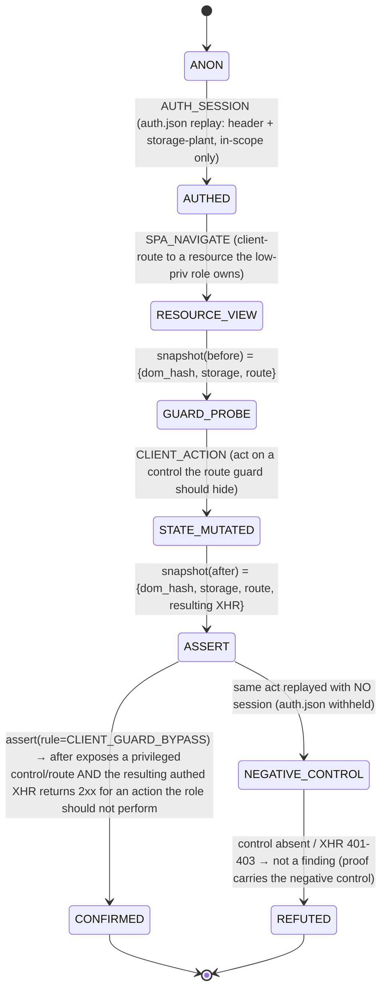

All load-bearing claims verified against code. Producing the WS-6 design section.

---

# WS-6 — Surface & Browser-Depth (Design Section)

> Design-only delta on the WS-6 audit. Branch `feat/alpha-observability`, HEAD `f75608f`. Every mechanism below is a labeled capability transition (e.g. `AUTH_SESSION → SPA_ACTION → CLIENT_STATE_ASSERT`), never a payload or runbook. Design rule D4 in force: every ticket ships flag-gated, default-OFF, byte-identical to prod when off.

## 1. H4 + H5 verdicts (+ current-state recap)

**H4 — CONFIRMED (HIGH).** Browser client-side proof stops at three single-page classes and there is no browser-driven `login → navigate → act → assert` SPA state-change oracle. `/instrument` reloads each URL fresh (`docker/browser/browser_server.py:1086-1136` — per-URL `context.new_page()` → `goto` → settle → `postMessage` → read `__domxss_hits`/`__domxss_pp_scan`/storage → `page.close()`), with no step-chaining and no post-action assertion. The only multi-step browser flows are login primitives (`_try_login` :673-712, gated `_try_sso_login` :641-670) whose sole job is to authenticate the crawl. **Nuance verified:** a multi-step *state-carrying* flow oracle exists but at the HTTP layer, not the browser — `channels.py:replay_sequences` (capture step N var → substitute step N+1) with `step_auth_bypassed`/`workflow_skip_succeeded`/`replay_succeeded` verdicts (`channels.py:151,157,162`), gated default-OFF (`config.py:302`). The missing capability is specifically *asserting a client-side/SPA state change after an authed in-browser action*.

**H5 — REFUTED (HIGH).** GraphQL-authz, WebSocket/SSE/webhook, and JWT/OAuth/session are **not** skill-only — each is a pure-Python deterministic oracle: `graphql_authz.py:field_authz_verdict:201, bopla_exposure:242, bopla_writability:268, depth_unlimited:333, batch_unlimited:338`; `channels.py:channel_auth_open:200, cross_user_leak:206, webhook_sig_bypassed:211, webhook_replayable:218`; JWT/session verdicts live in `exploit_floor.py` per the audit. The true gap is **shipped-OFF, not absent**: `config.py` defaults `scanner_graphql_authz_enabled:293=False`, `scanner_channel_oracles_enabled:302=False`, `scanner_auth_oracles_enabled:243=False`, `scanner_two_identity_authz_enabled:247=False`, `scanner_ai_redteam_floor:312=False` — against `scanner_exploit_floor_enabled:225=True` and `scanner_browser_enabled:328`/`scanner_browser_instrument_enabled:335`=True. A stock deploy therefore emits DOM-XSS/PP/storage-leak + the always-on floor + HAR-slice only.

**Recap (2 lines):** Browser sidecar = 3 endpoints (`/healthz:732`, `/crawl:737`, `/instrument:1032`); client-side proof = single-page DOM-XSS/PP/storage-leak; auth-state already captured once as `/work/auth.json` (bearer+cookies) and replayed in-scope-only via a route interceptor. The two WS-6 deltas: (a) add a browser act-then-assert oracle for SPA-only state changes [H4], and (b) turn the built-but-dark new-surface oracle suite ON via one operator profile [H5].

---

## 2. Browser worker API contract (typed verbs + auth-state persistence)

Today the sidecar exposes coarse endpoints (`CrawlRequest{url,max_pages,max_depth}` :715; `InstrumentRequest{urls,canaries[]}` :1020). The WS-6 design factors the *implicit* verbs already inside `/crawl` and `/instrument` into an explicit, typed **flow contract** — one new sibling endpoint `POST /flow` that consumes a declarative step list from `/work/flow.json` (mirrors the `channels.py` Track-A recorded-sequence schema) and returns per-step artifacts. No verb below is a command string; each is a capability with typed I/O the sidecar interprets.

| Verb | Input (typed) | Output (typed) | Backing mechanism (code-verified) |
|------|---------------|----------------|-----------------------------------|
| `navigate` | `{url: str(in-scope), wait: "domcontentloaded"\|"networkidle"}` | `{final_url, in_scope: bool, status}` | route interceptor aborts off-scope document nav (`browser_server.py:1071-1082`) |
| `act` | `{selector: str, action: "click"\|"fill"\|"submit", value?: masked}` | `{ok: bool, dom_delta_ref, nav_occurred: bool}` | reuses `_fill_login_fields`/`query_selector` machinery (`:694-707`); `submit` restricted to password-bearing forms unless flow explicitly opts a non-auth form |
| `snapshot` | `{capture: ["dom","storage","cookies","url"]}` | `{dom_hash, storage: {local,session} (secret-masked), route}` | live `page.evaluate("() => ({local:{...localStorage},...})")` (`:1130`) + `storage_secret_hits` masking (`:1133`) |
| `har` | `{slice_by: {endpoint,method,vuln_class}}` | `{request, response_excerpt}` (bounded) | `browser_ingest.py:sync_har_proof` bounded parse (`_HAR_MAX_BYTES:61`, caps `:62-64`) |
| `screenshot` | `{full_page: bool}` | `{artifact_path}` | existing per-crawl screenshot manifest emission |
| `assert` | `{before: SnapshotRef, after: SnapshotRef, rule: enum}` | `{verdict: bool, delta}` | **new** — pure comparator over two `snapshot` outputs (see §4) |

**Auth-state persistence (mechanism, not commands).** The capture-once/replay-many primitive already exists and the contract standardizes on it:

- **Capture once:** the fleet login worker (form `_try_login` :673 or gated SSO `_try_sso_login` :641) writes the post-login session to `/work/auth.json` as `{bearer, cookies{}}` (`_auth_session:526`). This is the single source of session truth — richer than raw env creds because it carries the *post-login* cookie/token.
- **Replay across steps — two channels, both in-scope-gated:**
  1. **Header replay** — `_auth_json_headers:496` turns `auth.json` into `Authorization: Bearer …` + `Cookie: …`, attached by the route interceptor *only* when `allowed(_host(url), scope)` (`:1079-1080`); creds never attach off-scope.
  2. **Storage planting (SPA boot-logged-in)** — `build_session_init_script:539` installs the bearer under the common SPA token keys (`_TOKEN_STORAGE_KEYS:523`) + `document.cookie` via `add_init_script` *before* app JS runs, so a client-routed SPA boots authenticated (gated `SCANNER_BROWSER_AUTHED_CRAWL`).

The WS-6 `/flow` endpoint reuses **both** replay channels unchanged: a flow's `navigate`/`act` steps run inside a context that already carries `{**_scoped_cred_headers(...), **_auth_json_headers(WORK_DIR)}` (the exact composition at `:1069`) plus the init-script plant. **No new credential path, no new secret handling** — auth-state persistence is "read `auth.json` once, apply the same two in-scope-only channels the crawl already uses."

---

## 3. One SPA scenario as a state diagram (capability-labeled)

Scenario: a client-routed SPA where a low-privilege authed user reaches a resource view whose *edit/privilege* control is hidden only by a client-side route guard (the guard never round-trips to the server). The state change surfaces in the SPA store and a subsequent API XHR, not in the raw document load — invisible to the offline HAR slice and to single-page `/instrument`. Transitions are labeled by **capability**, never by payload.

Key property: `CONFIRMED` requires **both** a client-observable state delta (`snapshot(after) ≠ snapshot(before)` in DOM/route/store) **and** a server-side effect confirmation (the resulting XHR status), with a mandatory `NEGATIVE_CONTROL` leg (same action, no session) — matching the competitor buyer-proof bar (working PoC + negative control + full attack path). The whole path is `AUTH_SESSION → SPA_NAVIGATE → CLIENT_ACTION → CLIENT_STATE_ASSERT`, the exact capability the audit found absent.

---

## 4. Client-side proof artifacts beyond DOM-XSS

Each new oracle = **INPUT** (what the browser observes) + **VERDICT** (deterministic decision rule). All ride the existing `/instrument`→`instrument_hit_to_finding`→`_INSTRUMENT_KIND_MAP` path (`browser_ingest.py:209`); shipping a new class is one dict entry (the pattern the code already documents at `:226`), plus the `assert` comparator from §2. No payloads.

| Oracle (new `kind`) | INPUT (observed) | VERDICT (deterministic rule) |
|---------------------|------------------|------------------------------|
| **`client_guard_bypass`** (client-side route-guard bypass) | `snapshot(before)` at a route the low-priv role should be denied; `snapshot(after)` following `act` on a hidden/privileged control | privileged route/control becomes reachable **and** the resulting authed XHR returns 2xx, **while** the negative-control leg (no session) is denied → `executed=true` |
| **`authed_dom_acbreak`** (authenticated-DOM access-control break) | two authed `snapshot`s of the *same* resource under two identities (reuses `scanner_two_identity_authz` inputs) rendered in-browser | identity-B's live DOM/store renders identity-A's resource fields (structural match of A-owned marker in B's rendered state) → break confirmed |
| **`clientside_workflow_skip`** | `snapshot` sequence across a multi-step SPA wizard where a later step is client-routed directly | terminal/privileged step reaches `RESOURCE_VIEW` state without the guarding intermediate step's store mutation present → skip confirmed (browser analogue of `channels.py:workflow_skip_succeeded:157`) |
| **`domxss_render_artifact`** (upgrade, not new class) | existing `/instrument` `executed=true` hit | at the executed hit, also capture `{screenshot, dom_snapshot, storage_snapshot}` so the DOM-XSS finding carries a **re-runnable rendered artifact**, not only the code snippet (closes the `browser_ingest.py:397-399` TODO for DOM/stored-XSS) |

The `assert` verb (§2) is the single deterministic comparator behind the first three: it diffs two `snapshot` outputs against a named rule enum and emits `executed=true` only on a rule match — the same "confirm is code, not LLM" property the platform already owns in `exploit_floor.py`.

---

## 5. Oracle designs for the skill-only classes (INPUT + VERDICT)

These oracles **already exist as pure code** (H5). WS-6's design contribution is to (a) confirm the INPUT/VERDICT contract matches the `exploit_floor.py` pure-oracle pattern (verified below) and (b) ship them via the §6 profile. No payloads; the "how to elicit" input is described as a capability, never a command.

### 5a. GraphQL authz (`graphql_authz.py`, wired `exploit_floor.py:_sweep_graphql`)
- **INPUT:** an introspection result → `index_schema:85`; two-identity response bodies for the same id-bearing/admin-shaped field → `field_authz_verdict(a_body, b_body, id_bearing, admin_shaped):201`; a single body for object-property exposure → `bopla_exposure:242`; before/after bodies for a mutated prop → `bopla_writability:268`; a response body for `depth_unlimited:333` / a batched body + count for `batch_unlimited:338`.
- **VERDICT:** `field_authz_verdict` returns `bola`/`bfla`/`None` from the *differential* of the two identities' bodies (identity-B reads identity-A's object, or a low-priv reads an admin-shaped field). `bopla_exposure` returns the list of over-exposed properties; `bopla_writability` returns True iff the after-body reflects the injected prop; `depth_unlimited`/`batch_unlimited` return True on unbounded acceptance. Every verdict is a pure function of observed bodies — identical shape to `exploit_floor.py:diff_access`/`diff_cross_tenant`.

### 5b. WebSocket / SSE / webhook (`channels.py`, wired `run_channels_sweep:431`)
- **INPUT:** parsed frames from an unauthenticated channel open → `channel_auth_open(anon_frames):200`; frames from identity-A's channel + a marker minted by identity-B → `cross_user_leak(frames_a, marker_b):206`; control vs. unsigned webhook delivery status → `webhook_sig_bypassed(control_status, unsigned_status):211`; first/second delivery status of a replayed webhook → `webhook_replayable:218`.
- **VERDICT:** `channel_auth_open` = True iff an anonymous open receives application frames (auth-free channel); `cross_user_leak` = True iff identity-B's marker appears in identity-A's frame stream (cross-tenant channel leak); `webhook_sig_bypassed` = True iff an unsigned delivery is accepted where the control was rejected; `webhook_replayable` = True iff a re-sent delivery succeeds twice (no anti-replay). Pure frame/status comparators — no LLM in the path.

### 5c. JWT / OAuth / session (`exploit_floor.py`, wired `_sweep_auth_session`)
- **INPUT:** a forged-token acceptance differential (`parse_jwt_forge`); an OIDC discovery-doc read for PKCE presence (`parse_pkce_missing` + `build_oidc_discovery_cmd`); pre/post-login session-id comparison (`parse_session_fixation`); session-id before/after a privilege change (`parse_session_no_rotation`); a post-logout token replay status (`parse_revoked_replay`).
- **VERDICT:** forge-accept = server treats a forged/`alg`-tampered token as valid; PKCE-missing = discovery doc omits PKCE support on a public client; fixation = session id unchanged across the auth boundary; no-rotation = id unchanged across a privilege elevation; revoked-replay = a logged-out token still authorizes. Each is a boolean over observed HTTP artifacts — the same pure-oracle contract as the always-on floor (`parse_cors`/`parse_host_header`/`parse_csrf`).

**Design tie-in:** all three families already satisfy the "deterministic confirm, code not LLM" moat. WS-6 adds nothing to their *logic*; it removes the shipping gap (§6) and, for the two-identity families (5a `bola/bfla`, 5b `cross_user_leak`), lets the §2 `/flow` endpoint supply the *browser-rendered* second-identity artifact the offline HAR slice cannot (`browser_ingest.py:397-399`).

---

## 6. Delta tickets (module / flag / state → buyer outcome; all default-OFF)

| # | Module & change | New flag (default) | State it changes | Buyer-visible outcome |
|---|-----------------|--------------------|------------------|-----------------------|
| **WS6-D1** | `docker/browser/browser_server.py`: add `POST /flow` sibling consuming `/work/flow.json` (Track-A schema from `channels.py`); reuses `_route` interceptor, `_auth_json_headers`, `build_session_init_script` unchanged | `scanner_browser_flow_assert` (**False**) | New endpoint; off ⇒ file absent-path is a no-op, sidecar byte-identical | A Playwright-captured before/after DOM+storage+XHR assertion becomes the live PoC for SPA-only state changes the HAR slice can't produce |
| **WS6-D2** | `browser_ingest.py`: add `client_guard_bypass`, `authed_dom_acbreak`, `clientside_workflow_skip` entries to `_INSTRUMENT_KIND_MAP:209`; add pure `assert(before,after,rule)` comparator | rides WS6-D1's flag (no separate gate) | New taxonomy `kind`→finding rows; off ⇒ map entries never produced | Client-side access-control / route-guard / workflow-skip findings ship with a deterministic verdict + negative control |
| **WS6-D3** | `browser_ingest.py:sync_har_proof`: fold live `{screenshot, dom_snapshot, storage_snapshot}` capture at each `/instrument executed=true` hit; gate the low-priv-admin render capture under the existing two-identity flag | reuses `scanner_two_identity_authz_enabled:247` (**False**); instrument capture rides always-on `/instrument` | Adds artifact to existing DOM-XSS/PP findings; closes TODO `:397-399` | Every client-side finding carries a re-runnable rendered artifact + negative control — matches competitor proof-completeness bar |
| **WS6-D4** | `config.py`: add an OR-profile knob that, when set, enables the built-but-dark suite (`graphql_authz`/`channel_oracles`/`auth_oracles`/`two_identity_authz`/`ai_redteam_floor`) in one switch; **individual flags stay default-OFF** so prod stays byte-identical | `scanner_oracle_profile` = `"floor"` (**default; = today's behavior**), `"full"` opt-in | Effective-value of the five gates when profile=`full`; profile=`floor` ⇒ every gate unchanged (all False) | A buyer demo turns the entire deterministic new-surface moat (GraphQL/WS/JWT-OAuth-session/two-identity/AI) ON without per-flag archaeology; default image unchanged |
| **WS6-D5** | `channels.py` Track-A auto-population seam: emit a `/work/flow.json` scaffold from crawl-observed multi-step XHR sequences (feeds both `/flow` and existing HTTP `replay_sequences`) | rides `scanner_channel_oracles_enabled:302` (**False**) | Populates the flow file the HTTP multi-step oracle currently needs operator-authored | Closes the audit gap "multi-step oracle effectively operator-manual" — state-carrying flow proof runs without hand-authored sequences |

**D4 compliance statement:** every ticket is flag-gated and default-OFF (D4-1..D4-3, D4-5) or rides an already-shipped-OFF flag (D4-4 keeps the five individual gates `False`; the profile default `"floor"` reproduces today's effective config exactly). A stock production deploy is byte-identical until an operator opts in. No DO-NOT-BUILD (D6) item is proposed — no recursive hierarchy, no generation-counter/freeze, no agent-to-agent chat, no pgvector memory, no ZAP-as-detector, no proxy-as-substrate; `/flow` is a stateless per-scan sidecar endpoint over the existing scope-gated, token-authed Playwright worker.

**Confidence:** H4/H5 verdicts, API contract, and oracle inventory = **HIGH** (all cited claims re-read against code this pass). Auto-population seam WS6-D5 = **MEDIUM** (depends on how reliably crawl XHR ordering reconstructs a valid step sequence; the comparator logic is proven, the *sequence inference* is new). `docker-compose.yml` pin values for the five gates were not read this pass — `config.py` defaults are all `False`; whether compose overrides any is **[UNVERIFIED]** here and should be checked before a "full-profile" buyer demo.