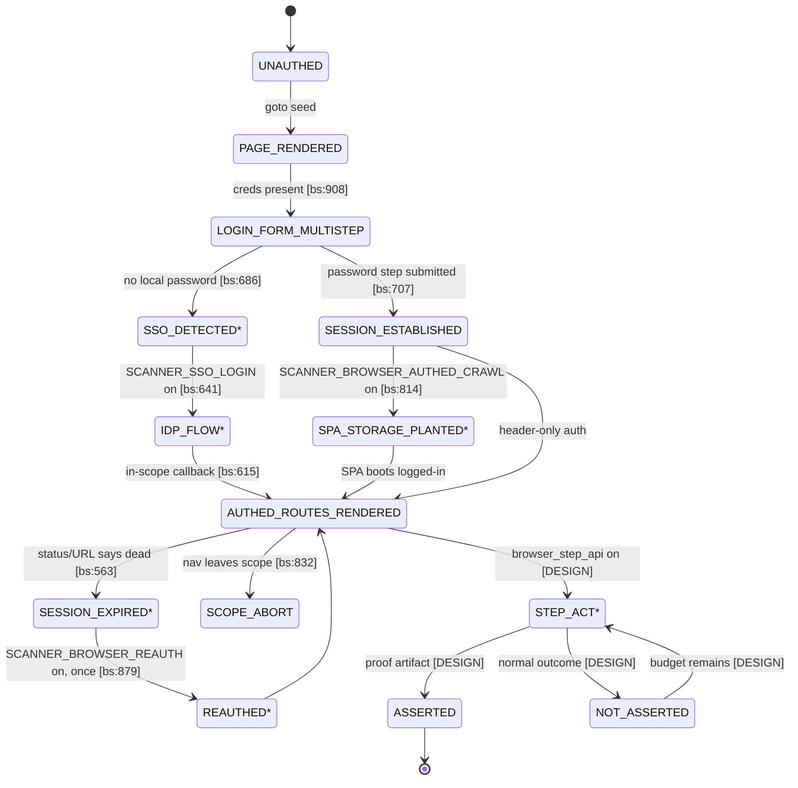

# WS-6 - Surface & Browser-Depth Capabilities (design only)

**Role:** READ-ONLY systems architect. No implementation, no payloads, no exploit steps, no runnable targeting commands.
**Source of truth:** the codebase at `C:\Users\ASUS\Desktop\abhdeii\autocan` (read this session, read-only).
**Notation:** `[CODE] file:line` = verified current-code claim. `[DESIGN]` = proposal, not in code. "not found in repo" = searched, absent. `[CONTEXT]` = number supplied by the task brief, not re-derived here.
**Path shorthand:** `agent_runtime/...` = `src/scanner/agent_runtime/...`; `engine/...` = `src/scanner/agent_runtime/engine/...`; `ledger/...` = `src/scanner/ledger/...`; `docker/...` = repo-root relative.
**Hard constraints honored:** D4 (every NEW capability below is flag-gated, default-OFF, byte-identical to production when off); R1 (capability models, state machines, API contracts, proof-type enums, INPUT/VERDICT specs, diagrams only -- mechanisms, never runnable payload/step sequences); citations never invented.

---

# PART 0 - FALSIFY H4 AND H5 FIRST

## H4 claim

> **H4:** "Client-side capability stops at DOM-XSS instrumentation; there is no multi-step SPA state-change capability."
> Supporting context: one scan produced **506 `clientside` cells applicable, 0 exercised; access family 1163 applicable / 0 exercised; scan status `completed`, open 0** `[CONTEXT]`.

### 0.1 The browser surface that actually exists (sidecar API inventory)

The per-scan browser sidecar exposes exactly three HTTP endpoints. There is no `click`/`fill`/`assert`/`evaluate` endpoint and no session handle the caller can drive step-by-step:

```text
[CODE] docker/browser/browser_server.py:732   @app.get("/healthz")
[CODE] docker/browser/browser_server.py:737   @app.post("/crawl")     -> CrawlResponse{seed, pages_crawled, routes, xhr, manifest}
[CODE] docker/browser/browser_server.py:1032  @app.post("/instrument") -> InstrumentResponse{urls, hits, executed, manifest}
```

Both POSTs are token-gated (`X-Browser-Token`) and scope-gated server-side (`allowed(host, scope)` `[CODE] docker/browser/browser_server.py:99`). Crawl breadth scales with scan mode (`_mode_limits` `[CODE] docker/browser/browser_server.py:165`).

### 0.2 What the agent itself can invoke

```text
[CODE] engine/runtimes/agents_runtime.py:253   _TOOL_NAMES = ("run_shell","read_file","grep","glob","write_file","web_fetch","browse","write_finding","record_coverage","oob")
[CODE] engine/runtimes/agents_runtime.py:638   _run("browse", browser.browse, {"url":..., "max_pages":...})
[CODE] engine/tools/browser.py:52              async def browse(url, max_pages=40, *, timeout=900)  # only /crawl is POSTed (browser.py:65-69)
[CODE] engine/guardrails.py:40                 _BROWSER_TOOLS = {"browse"}
```

`/instrument` is NOT agent-callable -- it is engine-driven, once per scan, behind `browser_instrument_on()`:

```text
[CODE] engine/context.py:237-239     recon-time ensure_instrument(...) if get_settings().browser_instrument_on(SCAN_MODE)
[CODE] engine/context.py:319-321     finalize-time ensure_instrument(...) (mirrors; instrument_*.json guard makes 2nd call a no-op)
[CODE] config.py:342-347             browser_instrument_on = scanner_browser_enabled AND (scanner_browser_instrument_enabled OR mode=="thorough")
[CODE] browser_fallback.py:158-190   ensure_instrument: POST up to max_urls=25 crawled routes (browser_fallback.py:165),
                                     returns 0 if instrument_*.json already exists (browser_fallback.py:174-175),
                                     injects stored-XSS canaries from browser/xss_canaries.txt (browser_fallback.py:147-155)
```

The instrumentation itself IS an execution oracle, not a string match: the init script plants a canary into sources, hooks sinks, and only fires a side-effect "if it actually ran" (`// Real-execution proof ... ONLY if it actually ran` `[CODE] docker/browser/browser_server.py:396`; prototype-pollution execution proof `[CODE] docker/browser/browser_server.py:434`); live web-storage is read back and pattern-matched (`page.evaluate` localStorage/sessionStorage + `storage_secret_hits` `[CODE] docker/browser/browser_server.py:1130-1133`, `[CODE] docker/browser/browser_server.py:254`).

Enabled by default in this tree, not OFF: `scanner_browser_enabled: bool = True  # on 2026-09-17` `[CODE] config.py:328`, `scanner_browser_instrument_enabled: bool = True  # on 2026-09-17` `[CODE] config.py:335`.

### 0.3 Multi-step SPA state change -- what already exists in code

The claim "no multi-step SPA state-change capability" must be tested against the sidecar's crawl, which already contains four stateful behaviors:

| Behavior | Where (code) | Gate | Default |
|---|---|---|---|
| Multi-step FORM login (identifier-first: fill user -> click next -> find password step -> submit password-bearing form only) | `_try_login` docstring + body `[CODE] docker/browser/browser_server.py:673-710`; called at `[CODE] docker/browser/browser_server.py:908` (`login_cred is not None and not logged_in`) | **ungated** -- fires whenever `SCAN_CREDENTIALS` carries username+password (`_login_cred` `[CODE] docker/browser/browser_server.py:469`) | active with creds |
| Plant captured session into SPA web storage + cookie BEFORE app JS so a client-routed SPA boots logged-in (P3-C.2 / #8) | `build_session_init_script` `[CODE] docker/browser/browser_server.py:539`; install at `[CODE] docker/browser/browser_server.py:812-819` | `_flag("SCANNER_BROWSER_AUTHED_CRAWL")` `[CODE] docker/browser/browser_server.py:814`, sidecar `_flag` = env truthy `[CODE] docker/browser/browser_server.py:72-75` | `scanner_browser_authed_crawl: bool = False` `[CODE] config.py:338` |
| Detect session death mid-crawl, re-plant captured session, reload ONCE (P3-C.3 / #4) | `is_session_expired` `[CODE] docker/browser/browser_server.py:563`, `should_crawl_reauth` `[CODE] docker/browser/browser_server.py:570`, one-shot at `[CODE] docker/browser/browser_server.py:877-889` (`reauthed = False` init `[CODE] docker/browser/browser_server.py:857`) | `_flag("SCANNER_BROWSER_REAUTH")` `[CODE] docker/browser/browser_server.py:879` | `scanner_browser_reauth: bool = False` `[CODE] config.py:339` |
| Federated (OAuth/OIDC/SAML) login flow: detect "sign in with X" affordance, drive IdP, accept in-scope callback | `detect_federated_login` `[CODE] docker/browser/browser_server.py:587`, `_try_sso_login` `[CODE] docker/browser/browser_server.py:641`, `sso_state` `[CODE] docker/browser/browser_server.py:597`, `sso_allows_nav` `[CODE] docker/browser/browser_server.py:615`, invoked from `[CODE] docker/browser/browser_server.py:686-689` | `_flag("SCANNER_SSO_LOGIN")` `[CODE] docker/browser/browser_server.py:686` | `scanner_sso_login: bool = False` `[CODE] config.py:340` |

Flag transport is real, not aspirational: the worker injects all three into the sidecar env `[CODE] scheduler/worker.py:689-691` (`SCANNER_BROWSER_AUTHED_CRAWL`, `SCANNER_BROWSER_REAUTH`, `SCANNER_SSO_LOGIN`), alongside `BROWSER_TOKEN` `[CODE] scheduler/worker.py:676` and the agent's `BROWSER_HOST/PORT/TOKEN` `[CODE] scheduler/worker.py:877-880`.

A second, HTTP-level multi-step capability also exists (recorded flow replay): `load_sequences` reads `/work/sequences.json` `[CODE] engine/channels.py:75`, `build_step_cmd` per step `[CODE] engine/channels.py:128`, verdicts `step_auth_bypassed`/`workflow_skip_succeeded`/`replay_succeeded` `[CODE] engine/channels.py:151,157,162`, driver `replay_sequences` `[CODE] engine/channels.py:471` -- gated `scanner_channel_oracles_enabled = False` `[CODE] config.py:302`, fail-closed gate `[CODE] engine/channels.py:61-67`.

### 0.4 What genuinely does NOT exist

1. **No agent-facing step primitives.** The model can only ask for a whole BFS crawl (`browse` -> `POST /crawl`) `[CODE] engine/tools/browser.py:52-69`. There is no per-step session handle, no `click`/`fill`/`assert_dom`, no way to assert a post-action state. The existing multi-step behaviors are hard-wired *inside* `/crawl` (login/re-auth/SSO), not a callable capability model.
2. **No browser-driven replay of recorded sequences.** `replay_sequences` issues curl-shaped commands `[CODE] engine/channels.py:128` -- HTTP-level, not DOM-level; client-rendered state cannot be replayed. And it is default-OFF.
3. **Instrumentation is a single bounded pass.** max 25 URLs `[CODE] browser_fallback.py:165`, once per scan `[CODE] browser_fallback.py:174-175`, routes taken from the crawl manifest only (`_crawled_routes` `[CODE] browser_fallback.py:131-144`) -- so instrumented coverage is a strict subset of crawled coverage, which is itself a subset of applicable `clientside` cells.
4. **The three SPA-depth flags are default-OFF** `[CODE] config.py:338-340`, so a default scan exercises zero of the P3-C depth even though the code is shipped.

### 0.5 VERDICT H4: **PARTIAL**

- **REFUTED -- "stops at DOM-XSS instrumentation."** Client-side capability is fourfold today: (a) deterministic BFS crawl with routes/XHR/HAR/screenshots as recon evidence `[CODE] engine/tools/browser.py:8-10`, `[CODE] browser_ingest.py:304-352`; (b) multi-step form login inside `/crawl` when credentials exist `[CODE] docker/browser/browser_server.py:673-710,908`; (c) real-execution DOM-XSS + prototype-pollution + live-storage-secret oracles `[CODE] docker/browser/browser_server.py:396,434,1130-1133`; (d) stored-XSS canary cross-render confirmation piped from the floor to `/instrument` (`B1: pipe the planted canary to the browser /instrument confirmer` `[CODE] engine/exploit_floor.py:3174`, canaries from `[CODE] browser_fallback.py:147-155`).
- **CONFIRMED -- "no multi-step SPA state-change capability," for the AGENT-FACING case.** No step API exists on the sidecar (0.1) and `browse` cannot do anything but crawl (0.2). What exists is fixed-function login/re-auth/SSO behavior buried in `/crawl`, i.e. a hard-coded happy path, not a state machine workers can drive, observe, and prove.
- **MITIGATION STATUS -- implemented-but-dark.** Authed-plant, re-auth and SSO are implemented and env-wired `[CODE] docker/browser/browser_server.py:812-819,877-889,686-689`, `[CODE] scheduler/worker.py:689-691` yet default-OFF `[CODE] config.py:338-340`. This is consistent with the observed outcome (506 clientside applicable / 0 exercised, access 1163 / 0, status `completed`) `[CONTEXT]`: the *client-side* half of that gap is explained by (i) family tool = dalfox (`"clientside": "dalfox"` `[CODE] oracle_map.py:16`) which never ran, and (ii) zero SPA-depth traversal beyond a plain crawl.
- **Honest-coverage defect found while testing H4** (feeds Section 5): `clientside` also contains SSRF/CORS/CSRF/OPEN_REDIRECT/PROTOTYPE_POLLUTION `[CODE] oracle_map.py:31-34` -- classes dalfox cannot probe, so even if dalfox fired, `exercised` would stay wrong for those cells (`coverage_qa._tool_fired_on` is substring-match on the family tool `[CODE] engine/coverage_qa.py:57,86-97`).

## H5 claim

> **H5:** "New-tech VAPT surfaces (GraphQL depth, WebSocket, AI/MCP) are declared in the taxonomy but lack deterministic oracles." Verdict per surface: **ORACLE EXISTS / SKILL-ONLY / NOT IN TAXONOMY**, each with `file:line`.

### 0.6 Per-surface verdicts (H5)

| Surface | Taxonomy | Deterministic oracle | Skill | VERDICT |
|---|---|---|---|---|
| GraphQL depth/batching | `GRAPHQL = "graphql"` `[CODE] taxonomy.py:84` | `depth_unlimited` `[CODE] engine/graphql_authz.py:333`, `batch_unlimited` `[CODE] engine/graphql_authz.py:338`, built by `build_deep_query`/`build_batch_query` `[CODE] engine/graphql_authz.py:310,321` over an introspection-indexed schema (`index_schema` `[CODE] engine/graphql_authz.py:85`) | `performing-graphql-depth-limit-attack`, `performing-graphql-introspection-attack` (skills dir) | **ORACLE EXISTS** (flag-OFF: `scanner_graphql_authz_enabled = False` `[CODE] config.py:293`; floor gate `[CODE] engine/exploit_floor.py:4992`, sweep `_sweep_graphql` `[CODE] engine/exploit_floor.py:4751`, wired at `[CODE] engine/exploit_floor.py:4994`) |
| GraphQL authz/BOPLA (adjacent, same class) | `[CODE] taxonomy.py:84` | `field_authz_verdict` `[CODE] engine/graphql_authz.py:201`, `bopla_exposure` `[CODE] engine/graphql_authz.py:242`, `bopla_writability` `[CODE] engine/graphql_authz.py:268` | same as above | **ORACLE EXISTS** (same flag) |
| WebSocket | `WEBSOCKET = "websocket"` `[CODE] taxonomy.py:81` | `channel_auth_open(anon_frames)` (unauth channel open) `[CODE] engine/channels.py:200`; `cross_user_leak(frames_a, marker_b)` `[CODE] engine/channels.py:206`; drivers `build_ws_cmd` `[CODE] engine/channels.py:172`, `_sweep_ws_cell` `[CODE] engine/channels.py:245` | `exploiting-websocket-vulnerabilities` (skills dir) | **ORACLE EXISTS** (flag-OFF: `scanner_channel_oracles_enabled = False` `[CODE] config.py:302`; gate `[CODE] engine/channels.py:61-67`; floor gate `[CODE] engine/exploit_floor.py:5019`, `run_channels_sweep` called at `[CODE] engine/exploit_floor.py:5021`) |
| SSE (event stream) | **no dedicated class** -- SSE endpoints ingest as `websocket`-kind cells (`_WEB_KINDS = {"url","websocket","graphql","webhook"}` `[CODE] inventory_ingest.py:76`); `/sse` fallback probes exist inside the WS sweep (`build_sse_cmd` `[CODE] engine/channels.py:182`, used at `[CODE] engine/channels.py:290,328`) | `channel_auth_open`/`cross_user_leak` reused over parsed frames (`parse_ws_frames` `[CODE] engine/channels.py:191`) | via `exploiting-websocket-vulnerabilities` | **ORACLE EXISTS under the websocket class**; SSE is NOT IN TAXONOMY as its own `VulnClass` |
| Webhook | `WEBHOOK = "webhook"` `[CODE] taxonomy.py:82` | `webhook_sig_bypassed(control, unsigned)` `[CODE] engine/channels.py:211`, `webhook_replayable(first, second)` `[CODE] engine/channels.py:218`, `_sweep_webhook_cell` `[CODE] engine/channels.py:349` | not found in skills catalog | **ORACLE EXISTS** (flag-OFF, same channels flag); skill absent (opposite failure mode) |
| AI / LLM (prompt injection, tool abuse, indirect injection, system-prompt leak, RAG leak) | 5 classes `[CODE] taxonomy.py:89-93`, materialized only on an `ai_endpoint` element behind the floor flag (`taxonomy.py:87-88` comment; element minted at `[CODE] inventory_ingest.py:629-632`) | `canary_in_output(stdout, canary)` verbatim oracle `[CODE] engine/ai_redteam.py:64-65`; `tool_invoked(stdout, canary_tool)` `[CODE] engine/ai_redteam.py:95`; OOB-sink indirect injection builder `[CODE] engine/ai_redteam.py:112`; gray-box secret/RAG probes `[CODE] engine/ai_redteam.py:123,132`; probe builders `[CODE] engine/ai_redteam.py:36,70` | not found in skills catalog | **ORACLE EXISTS** (two-layer gate: `scanner_ai_redteam_floor = False` `[CODE] config.py:312` + runtime witness; floor gate `[CODE] engine/exploit_floor.py:4955`, sweep `_sweep_ai` `[CODE] engine/exploit_floor.py:3550`, wired `[CODE] engine/exploit_floor.py:4925`) |
| MCP (as a distinct surface) | **NOT IN TAXONOMY** -- no `MCP_*` `VulnClass`; only a detection comment ("P3-H: recon proved an OpenAI-compatible / MCP surface" `[CODE] inventory_ingest.py:630`) and tool-abuse mechanics reused from the AI classes | partially, via `tool_invoked` `[CODE] engine/ai_redteam.py:95` (no MCP-specific verdict) | not found in skills catalog | **NOT IN TAXONOMY** as its own class; **SKILL-ONLY-adjacent** (no class + no skill + only inherited oracle) |
| JWT / OAuth / session (proven technology, listed for completeness) | `JWT_FLAWS`, `OAUTH_SAML`, `WEAK_SESSION` `[CODE] taxonomy.py:52-54` | in-band differentials: CRLF header-split self-proof, OAuth `redirect_uri` marker self-proof, safe CL.TE timing differential -- documented in `_sweep_authclass` docstring `[CODE] engine/exploit_floor.py:4052-4061`, plus session-seeded JWT pass `_sweep_auth_session` `[CODE] engine/exploit_floor.py:4179`; gate `_auth_oracles_enabled` `[CODE] engine/exploit_floor.py:576-582` | `performing-jwt-none-algorithm-attack`, `exploiting-jwt-algorithm-confusion-attack`, `exploiting-oauth-misconfiguration` | **ORACLE EXISTS** (flag-OFF: `scanner_auth_oracles_enabled = False` `[CODE] config.py:243`) |
| Race condition (skill-heavy, oracle-poor) | `RACE_CONDITION = "race_condition"` `[CODE] taxonomy.py:74` | explicitly NONE: `build_race_cmd` ... "Signal-only - a race outcome is not deterministically provable" `[CODE] engine/exploit_floor.py:860-862`, fired for race/quota cells `[CODE] engine/exploit_floor.py:3933-3934` | `exploiting-race-condition-vulnerabilities`, `pentest-race-conditions` | **SKILL-ONLY** (skills present, deterministic verdict deliberately absent) |
| DOM-XSS / reflected / stored XSS | `XSS_DOM`, `XSS_REFLECTED`, `XSS_STORED` `[CODE] taxonomy.py:29-31]` | real-execution canary in `/instrument` `[CODE] docker/browser/browser_server.py:396` + marker-echo + dalfox fallback in `_sweep_clientside` `[CODE] engine/exploit_floor.py:3234`, stored cross-check `_sweep_stored_xss` `[CODE] engine/exploit_floor.py:3147` | `dalfox-xss` family (skills dir), `pentest-browser` | **ORACLE EXISTS** (default-ON for instrument `[CODE] config.py:335`; dalfox sweep is the family floor) |

### 0.7 VERDICT H5: **REFUTED as a blanket claim -- but a narrower, different defect is CONFIRMED**

- **REFUTED:** the flagship "new-tech" surfaces DO carry deterministic, in-band, flag-gated oracles: GraphQL depth/batching/authz/BOPLA (`graphql_authz.py:85,201,242,333,338`), WebSocket/SSE/webhook channel oracles (`channels.py:200,206,211,218`), AI canary/tool-call oracles (`ai_redteam.py:64,95`). None of them is "declared but unimplemented."
- **CONFIRMED (restated, sharper):** three real defects remain, and they are *wiring* defects, not missing-oracle defects:
  1. **Every new-tech oracle is default-OFF** (`config.py:293,302,312,243`), so a default scan runs zero of them -- exactly the observed 0-exercised outcome `[CONTEXT]`.
  2. **Taxonomy classes exist but the coverage map does not know them.** `_GROUPS` in `oracle_map.py` contains only injection/access/clientside/logic `[CODE] oracle_map.py:21-39`; `WEBSOCKET`, `WEBHOOK`, `GRAPHQL`, `AI_*` are absent, and "Classes not listed fall to `config`" `[CODE] oracle_map.py:41-43`, i.e. **nuclei** (`"config": "nuclei"` `[CODE] oracle_map.py:17`) is recorded as *the* required oracle for websocket/webhook/graphql/ai cells (`required_oracle_for` `[CODE] oracle_map.py:47-52`). The same map is imported by father (`father.py:31`) and by coverage QA (`engine/coverage_qa.py:25`), so both inherit the mis-mapping (`coverage_qa.py:52-53`).
  3. **Genuinely SKILL-ONLY pockets exist** -- race conditions (`exploit_floor.py:860-862` declares the verdict impossible) and MCP (no class, no skill, inherited oracle only, `inventory_ingest.py:630`).

---

# PART 1 - DESIGN (all flag-gated, default-OFF, byte-identical when off)

## 1. Browser worker API contract

**Purpose:** give workers an *observable, bounded, provable* way to change SPA state and assert the result -- closing the agent-facing gap identified in 0.4 without handing the model a browser or arbitrary JS.

**New flag:** `scanner_browser_step_api: bool = False` `[DESIGN]` (lives beside `config.py:338-340`; worker passes `SCANNER_BROWSER_STEP_API` exactly like the P3-C trio `[DESIGN]` at `scheduler/worker.py:689-691` style). Off => the three endpoints below are not registered (404), no session objects are allocated, `/crawl` and `/instrument` byte-identical.

**Tool surface:** one agent tool, `browse_step` `[DESIGN]`, registered only when the flag is on (mirrors `_TOOL_NAMES` gating `[DESIGN]` at `engine/runtimes/agents_runtime.py:253`). It is a thin typed client; all authority stays server-side.

### 1.1 Capability model (what a session may do)

```text
CAPABILITY = {
  navigation:   goto(url)                      -- scope-checked, one document nav
  interaction:  click(selector), fill(selector, value), press(key)
  observation:  screenshot(), assert_dom(selector, relation, literal),
                assert_storage(area, key, relation, value_class),
                assert_xhr(match, timeout_ms)
  lifecycle:    reset(), close()
}
BOUNDING RULES [DESIGN]:
  - selector: CSS only, <= 256 chars, no script/style content, no JS expressions
    (the sidecar never evaluates model text; assertions run a FIXED library of
     predicates over page.evaluate outputs)
  - fill value: constrained to marker/token classes (canary, numeric, enum) --
    R1: no payload strings travel this API; exploitation stays in floor code
  - budget: max_steps_per_session (default 25), max_sessions_per_scan (default 3),
    per-step wall 15s; exceeding budget => VERDICT SKIPPED_BUDGET, session closed
  - every action passes the SAME server-side scope gate as /crawl (`allowed()` 
    docker/browser/browser_server.py:99) or returns SKIPPED_SCOPE
```

### 1.2 API contract (INPUT / OUTPUT, bounded)

```text
POST /session         (sidecar, X-Browser-Token)
  INPUT  : {"seed_url": str, "identity": "anon"|"primary"|"tenant_b", "plant_session": bool}
  OUTPUT : {"session_id": str, "scoped_hosts": [str...], "boots_authed": bool,
            "planted": bool, "budget": int}
  VERDICT: CREATED | SKIPPED_FLAG_OFF | SKIPPED_SCOPE | ERROR

POST /step
  INPUT  : {"session_id": str, "action": "goto"|"click"|"fill"|"press"|
                             "screenshot"|"assert_dom"|"assert_storage"|"assert_xhr",
            "selector"?: str, "value"?: str, "relation"?: "exists"|"absent"|"text_eq"|"text_contains",
            "area"?: "local"|"session"|"cookie", "key"?: str, "value_class"?: "canary"|"present",
            "match"?: {"method"?: str, "url_substr": str, "status"?: int}, "timeout_ms"?: int}
  OUTPUT : {"verdict": VERDICT, "proof_type": PROOF_TYPE, "artifact": str,
            "remaining_budget": int}
  VERDICT: ASSERTED | NOT_ASSERTED | SKIPPED_FLAG_OFF | SKIPPED_SCOPE |
           SKIPPED_BUDGET | SESSION_EXPIRED | ERROR
  (NOT_ASSERTED is a normal, non-finding outcome -- it never resolves a ledger cell;
   only ASSERTED with a proof artifact can feed an evidence row [DESIGN])

POST /session/close    INPUT: {"session_id"}  -> OUTPUT {"closed": bool}
```

```text
PROOF_TYPE enum [DESIGN] (see Section 3 for the full taxonomy):
  EXEC_CANARY | ASSERT_DOM | ASSERT_STORAGE | NETWORK_CAPTURE | SCREENSHOT_REF
```

### 1.3 Contract decisions and why

| Decision | Rationale (code seam) |
|---|---|
| Assertions, not eval | `/instrument` already proves the pattern: fixed init script + canary side-effect `[CODE] docker/browser/browser_server.py:354-396`; the step API extends it rather than inventing a script channel |
| Session handle server-side | sidecar is stateless per request today (each `/crawl` builds its own context `[CODE] docker/browser/browser_server.py:737`); sessions keep worker code simple while bounding lifetime |
| Identity is an enum, not cookies | mirrors two-identity/oracle patterns already in the floor (`scanner_two_identity_authz_enabled` `[CODE] config.py:247`, `tenant_b` detection `[CODE] engine/auth_bootstrap.py:237`) -- workers never see token material |
| Reuse `write_evidence`, no new store | browser evidence already lands as `EvidenceObject` rows via `write_evidence` (`kind="recon"`, `method="browser"` `[CODE] browser_ingest.py:33,352`; finding-kind HAR slice `method="browser_har"` `[CODE] browser_ingest.py:372,427`) |
| Fail-closed gate | sidecar `_flag` returns False on absent env `[CODE] docker/browser/browser_server.py:72-75` -- same lazy/default-safe pattern as `channels._channel_oracles_enabled` `[CODE] engine/channels.py:61-67` |

## 2. SPA state diagram

Current shipped behavior (solid = exists; `*` = flag-gated, default-OFF):

```text
                    SCAN_CREDENTIALS present?
                     [docker/browser/browser_server.py:469,908]
                              |
   +--------------------------+---------------------------+
   |                                                      |
   v                                                      v
 UNAUTHED ----goto/seed----> PAGE_RENDERED <---reload--- REAUTHED*
   |                            |   ^                     ^
   | (username+password)        |   | SCANNER_BROWSER_REAUTH*
   v                            |   | [bs.py:879-889]
 LOGIN_FORM_MULTISTEP           |   |
 [bs.py:673-710]                |   |
   |  |                         |   |
   |  +--no local password--> SSO_DETECTED* --> IDP_FLOW* --> CALLBACK_IN_SCOPE*
   |     SCANNER_SSO_LOGIN*        [bs.py:587,641,615,686-689]      |
   |                                                                  |
   +--> SESSION_ESTABLISHED --> |                                     |
                                |   SPA_STORAGE_PLANTED*              |
                                |   [bs.py:812-819, build_session_init_script:539]
                                v
                     AUTHED_ROUTES_RENDERED ----+--> route/XHR observed -> routes+xhr manifest
                                |                |    [CrawlResponse; browser.py:74-81]
                                | expires        |
                                v                v
                     SESSION_EXPIRED* -----> SCOPE_ABORT (any nav leaving scope)
                       [bs.py:563,570]       [bs.py:821-832, sso_allows_nav:615]
                                |
                                +--(once)--> re-plant + reload --> AUTHED_ROUTES_RENDERED

 PROPOSED EXTENSION (Section 1, scanner_browser_step_api*):
   AUTHED_ROUTES_RENDERED --> STEP_ACT (click/fill/goto) --> ASSERT_* --> ASSERTED (proof) | NOT_ASSERTED
                                  ^                                      |
                                  +------------ budget exhausted --------+--> SESSION_CLOSED
```

Mermaid form:



Per-transition proof artifacts (what a worker/verifier may cite):

| Transition | Gate | Artifact written |
|---|---|---|
| PAGE_RENDERED -> routes/XHR | always (browser on) | `crawl_*.json` manifest + HAR + screenshots -> `sync_browser` recon EvidenceObject `[CODE] browser_ingest.py:304-352` |
| LOGIN_FORM_MULTISTEP -> SESSION_ESTABLISHED | creds present | sidecar log line `[CODE] docker/browser/browser_server.py:709`; authed crawl routes appear in manifest |
| SPA_STORAGE_PLANTED | `SCANNER_BROWSER_AUTHED_CRAWL` | init-script install `[CODE] docker/browser/browser_server.py:819`; presence provable via new `assert_storage` `[DESIGN]` |
| SESSION_EXPIRED -> REAUTHED | `SCANNER_BROWSER_REAUTH` | sidecar log + `reauthed` flag `[CODE] docker/browser/browser_server.py:880-889` |
| instrumented route -> execution proof | `browser_instrument_on` `[CODE] config.py:342-347` | `instrument_*.json` -> `sync_instrument_findings` -> xss_dom finding `[CODE] browser_ingest.py:216-263` |
| STEP_ACT -> ASSERTED | `scanner_browser_step_api` | evidence row with `proof_type=ASSERT_DOM/STORAGE/EXEC_CANARY` `[DESIGN]` |

## 3. Execution-oracle artifacts (proof-type taxonomy + verdict contract)

### 3.1 Proof-type enum (existing + proposed)

```text
PROOF_TYPE =
  | EXEC_CANARY          real side-effect of executed JS (instrument canary callback)
  | CONTENT_REPLAY       re-issue captured request, marker still in body
  | DIFF_IDENTITY        two identities / auth-vs-anon differential
  | OOB_CALLBACK         out-of-band token minted and fired
  | CHANNEL_DIFF         WS/SSE/webhook control-vs-treatment differential
  | SEQUENCE_DIFF        recorded multi-step flow: skip/strip/replay differential
  | ASSERT_DOM           step API: fixed predicate over post-action DOM
  | ASSERT_STORAGE       step API: canary/presence in local/session/cookie
  | NETWORK_CAPTURE      step API: matching XHR observed after action
  | SIGNAL_ONLY          non-proving signal (explicitly NOT evidence)
  | SCREENSHOT_REF       human-facing illustration (never a verdict basis)
```

Existing mapping (each already ships):

| PROOF_TYPE | Verdict function | Code |
|---|---|---|
| EXEC_CANARY | sink hook fires only if payload ran | `[CODE] docker/browser/browser_server.py:396,434` |
| CONTENT_REPLAY | `replay_decision(marker, fresh_response)` | `[CODE] engine/detached_verify.py:98`, marker pick `[CODE] engine/detached_verify.py:83` |
| DIFF_IDENTITY | two-identity authz verdicts; **fail-open by construction** ("A deny-list that WINS over the allow-list ... never a false '200 == access'" `[CODE] engine/detached_verify.py:44-47`) | `[CODE] engine/detached_verify.py:10-13,44-47` |
| OOB_CALLBACK | `oob_token.fired` tally | `[CODE] engine/coverage_qa.py:73-76` |
| CHANNEL_DIFF | `channel_auth_open`, `cross_user_leak`, `webhook_sig_bypassed`, `webhook_replayable` | `[CODE] engine/channels.py:200,206,211,218` |
| SEQUENCE_DIFF | `step_auth_bypassed`, `workflow_skip_succeeded`, `replay_succeeded` | `[CODE] engine/channels.py:151,157,162` |
| ASSERT_DOM / ASSERT_STORAGE / NETWORK_CAPTURE | (proposed) | `[DESIGN]` Section 1 |
| SIGNAL_ONLY | race "signal-only - a race outcome is not deterministically provable" | `[CODE] engine/exploit_floor.py:860-862` |

### 3.2 Verdict contract (single vocabulary across verifier, ledger, report)

```text
VERDICT =
  | REPRODUCED        independent re-fire reproduced the proof (verifier path)
  | NOT_REPRODUCED    could not reproduce / no impact
  | ASSERTED          step API produced a proof artifact this run
  | NOT_ASSERTED      step ran, no proof -- normal, never closes a cell
  | BLOCKED_FLAG_OFF  applicable + oracle exists, but its flag is default-OFF
  | BLOCKED_SCOPE     out of scope / platform-blocked
  | N_A               not applicable for this asset
  | SIGNAL_ONLY       candidate signal, never a verified finding
```

Existing seams this consolidates (no behavior change when flags off):

- LLM-verifier sentinels: `VERDICT: REPRODUCED / NOT_REPRODUCED` with LAST-line-wins parse `[CODE] hooks/verification.py:66-69,121-124,130-139`, mandatory `PROOF-CAPSULE` JSON `[CODE] hooks/verification.py:62-65,142`; recipes demand execution proof, "Reflected-but-not-executed = NOT_REPRODUCED" `[CODE] hooks/verification.py:71-75`.
- Ledger states already include `pending_oracle` / `pending_human` `[CODE] ledger/service.py:970` and `blocked` with reason `[CODE] ledger/service.py:1010-1016` -- `BLOCKED_FLAG_OFF` is a *reason value* on `blocked`, not a new state `[DESIGN]`.
- Detached verifier deliberately FAIL-OPEN for differential classes `[CODE] engine/detached_verify.py:44-47` -> those classes can only ever be DIFF_IDENTITY.

### 3.3 Artifact contract (one JSON shape, one writer)

```text
ExecutionArtifact [DESIGN] (written ONLY when verdict in {REPRODUCED, ASSERTED}):
{
  "verdict": ..., "proof_type": ..., "flag_state": {"<flag>": bool, ...},
  "request": ..., "response_excerpt": ..., "canary"?: ...,
  "artifact_path": "browser/instrument_*.json | browser/crawl_*.json | har slice",
  "session"?: {"step": n, "action": ..., "selector_hash": ...},
  "tool": ..., "wall_ms": ...
}
WRITER: scanner/agent_runtime/evidence.write_evidence  (already imported
  for browser rows [CODE] browser_ingest.py:33; recon row [CODE] browser_ingest.py:352;
  finding row [CODE] browser_ingest.py:427; HAR slice method="browser_har"
  [CODE] browser_ingest.py:372,381)
NEGATIVE VERDICTS: never an artifact -- they are coverage/ledger state only,
  so the ledger cannot be padded with non-proofs [DESIGN] (matches the
  "No evidence, no finding" contract and existing fail-open rules).
```

## 4. Skill-only oracle designs (convert skills into INPUT/VERDICT pairs)

**Pattern [DESIGN]:** every skill-only surface gets `(probe builder, deterministic predicate, artifact path)`; the skill documents *when/how to drive* it, the floor owns *firing + verdict* (LLM proposes, oracle disposes -- same split as `[CODE] engine/exploit_floor.py:1894`).

| # | Surface (skill exists, verdict missing) | INPUT spec | VERDICT spec | Gate |
|---|---|---|---|---|
| S1 | Race condition (`exploiting-race-condition-vulnerabilities`, `pentest-race-conditions`; code says signal-only `[CODE] engine/exploit_floor.py:860-862`) | `{endpoint, param, nonce, n}` -> two temporally adjacent mutations with distinct nonces + a READ-BACK request for state | `READBACK_VALUE == nonce_b AND nonce_a absent` (state-delta oracle; gray-box endpoints only). Until a read-back exists: `SIGNAL_ONLY`, never auto-verified `[DESIGN]` | `scanner_auth_oracles_enabled` sibling flag `[DESIGN]` |
| S2 | MCP (NOT IN TAXONOMY `[CODE] inventory_ingest.py:630`, no skill, no class) | (a) add `MCP_TOOL_SHADOWING` `VulnClass` behind `scanner_ai_redteam_floor` `[DESIGN]` (materialization already rides the `ai_endpoint` element `[CODE] taxonomy.py:87-88, inventory_ingest.py:629-632`); (b) INPUT = `{mcp_url, canary_tool}` probe via existing builder `[CODE] engine/ai_redteam.py:70` | `tool_invoked(stdout, canary_tool)` `[CODE] engine/ai_redteam.py:95` reused verbatim | `scanner_ai_redteam_floor` `[CODE] config.py:312` |
| S3 | AI/LLM (oracle exists, **skill missing** -- inverse failure) | new skill `pentest-ai-llm` `[DESIGN]` whose workflow names ONLY existing builders: chat probe `[CODE] engine/ai_redteam.py:36`, indirect injection w/ OOB host `[CODE] engine/ai_redteam.py:112`, gray-box secret/RAG `[CODE] engine/ai_redteam.py:123,132` | `canary_in_output` `[CODE] engine/ai_redteam.py:64-65` / OOB fired | flag `[CODE] config.py:312` |
| S4 | SSE (no own class; rides websocket cells `[CODE] inventory_ingest.py:76`) | keep `build_sse_cmd` `[CODE] engine/channels.py:182` input; extend `exploiting-websocket-vulnerabilities` skill text with an SSE section `[DESIGN]` | `channel_auth_open` / `cross_user_leak` over `parse_ws_frames` `[CODE] engine/channels.py:191,200,206` | `scanner_channel_oracles_enabled` `[CODE] config.py:302` |
| S5 | SPA multi-step (`pentest-browser` is crawl-only by its own text: "That's it. The sidecar runs a deterministic BFS" `[CODE] skills/pentest-browser/SKILL.md:26`, "The browser's job is discovery; exploitation stays in the other skills" `:36`) | extend skill with a *conditional* step section `[DESIGN]`: only when `browser_step_api` is on, INPUT = bounded step sequence + assertion (Section 1 INPUT) | `ASSERTED` with `proof_type=ASSERT_DOM/STORAGE/EXEC_CANARY` | `scanner_browser_step_api` `[DESIGN]` |
| S6 | Webhook (oracle exists, skill missing) | new skill section documenting control-vs-unsigned differential as mechanism only `[DESIGN]` | `webhook_sig_bypassed` / `webhook_replayable` `[CODE] engine/channels.py:211,218` | `scanner_channel_oracles_enabled` `[CODE] config.py:302` |

Explicit non-goal: no skill may close a ledger cell by prose. The skill gate reads the *required oracle tool* (`required_oracle_for` `[CODE] oracle_map.py:47-52` via `_oracle_fired` `[CODE] ledger/service.py:136-148`) -- so S1-S6 only matter because their families also get honest tool mappings (Section 5.1).

## 5. Honest-coverage wiring

### 5.1 Fix the class -> family -> tool map (root cause of the 0-exercised illusion)

```text
CURRENT [CODE]: oracle_map.py:21-39 _GROUPS = {injection, access, clientside, logic}
                oracle_map.py:41-43  "Classes not listed fall to config"
                oracle_map.py:17     "config": "nuclei"
  => websocket/webhook/graphql/ai_* cells -> family "config" -> REQUIRED ORACLE = nuclei
  => consumers: ledger (oracle_map.py:1-6 rationale; service.py:42,136,148,221)
                father  (father.py:31,397,414,1270)
                coverage_qa (coverage_qa.py:25,52-53)

PROPOSED [DESIGN]:
  _GROUPS += "channels": (WEBSOCKET, WEBHOOK)          -> oracle "channels"
             "gql":      (GRAPHQL)                      -> oracle "graphql"
             "ai":       (AI_PROMPT_INJECTION, AI_INDIRECT_INJECTION,
                          AI_SYSTEM_PROMPT_LEAK, AI_TOOL_ABUSE, AI_RAG_LEAK) -> oracle "ai"
  PHASE_EXPLOIT_TOOL += {"channels": "channels", "gql": "graphql", "ai": "ai_redteam"}
  (exact tool-name strings = the floor family names that produce tool_invocations
   rows for these sweeps, so _tool_fired_on [CODE] coverage_qa.py:86-97 can match)
  clientside: split dalfox-only classes (XSS_*) from SSRF/CORS/CSRF/OPEN_REDIRECT/
  PP classes so "exercised" stops requiring dalfox for a class dalfox cannot probe
```

### 5.2 Make coverage quality FLAG-AWARE (report blocked-by-flag, not silent gap)

```text
CURRENT [CODE]: coverage_qa.compute_coverage_quality -> families/families.gap/oob/lines
                (coverage_qa.py:33-83); written to /work/coverage_quality.json
                (coverage_qa.py:122-136); called from engine/run.py:134,141,368;
                ADDITIVE + never raises, never drives control flow (coverage_qa.py:9-12)

PROPOSED [DESIGN]: per family add
  oracle_availability: "wired_on" | "wired_off(default)" | "no_oracle" | "signal_only"
  and per family: applicable / exercised / blocked_flag_off / gap
  blocked_flag_off = applicable - exercised WHERE availability == wired_off
  availability read from the SAME settings the floor gates read
    (exploit_floor.py:576,611,643; channels.py:61-67; config.py:243,293,302,312)
  output: coverage_quality.json gains {"oracle_availability": {...}, "flag_off": [...]}
  STILL additive/report-only -- scan status logic untouched [DESIGN] (coverage_qa.py:9-12)
```

### 5.3 Give the ledger an honest terminal reason (no false "clean")

```text
CURRENT [CODE]: close gates exist and default OFF:
  scanner_evidence_gate=False        (config.py:193)
  scanner_ledger_machine_close=False (config.py:201)
  scanner_ledger_skill_gate=False    (config.py:209)
  scanner_oracle_first=False         (config.py:218)
  read at sync_from_work (ledger/service.py:1055-1060) -> resolve_cells(750..)
  skill gate uses required_oracle_for (service.py:136-148, 221-224)
  oracle_first: "an unrun oracle is not a pass" (service.py:1060; finalize.py:1276)
  completion: count_open_cells (1139) / scan_is_complete (1184) /
              graceful_terminal_status -> "completed" (1203)

PROPOSED [DESIGN]:
  - new close reason na_reason = "blocked_flag_off:<flag>" on the existing
    `blocked` state (service.py:1010-1016) -- no new state machine
  - resolve_cells assigns it when: cell applicable AND its family oracle is
    wired but the governing flag is False (availability map of 5.2)
  - completion treats it as RESOLVED-WITH-REASON: scan_is_complete still true,
    but the report line reads "1163 blocked_flag_off (scanner_auth_oracles_enabled)"
    instead of an unexplained 0 exercised
  - all of it behind the EXISTING gates (5 flags, defaults unchanged) so a
    default deploy's status strings are byte-identical [D4]
```

### 5.4 End-state honesty table (before vs after)

```text
BEFORE [CONTEXT]:  clientside 506 applicable / 0 exercised; access 1163 / 0;
                   status "completed", open 0  (looks like "we checked, nothing there")

AFTER  [DESIGN]:   clientside: 506 applicable / X dalfox-exercised / 506-X broken down as
                     - "instrument pass ran (n routes, flag ON)"  [CODE today: config.py:335]
                     - "dalfox required but not fired"            [CODE today: oracle_map.py:16]
                     - "class not dalfox-probeable (ssrf/cors/...)" [CODE today: oracle_map.py:31-34]
                   access: 1163 applicable / 0 exercised /
                     "1163 blocked_flag_off: scanner_auth_oracles_enabled=false"
                     [CODE today: config.py:243, engine/exploit_floor.py:4052-4061]
                   graphql/websocket/ai: shown under their OWN families
                     (5.1) with "wired_off(default)" availability [DESIGN]
```

---

# RANKED INTEGRATION PLAN (R7 - module + flag + buyer-visible outcome)

| # | Module (touch point) | Flag (default OFF) | Buyer-visible outcome |
|---|---|---|---|
| 1 | `oracle_map.py` `_GROUPS`/`PHASE_EXPLOIT_TOOL` + consumers (`father.py:31`, `coverage_qa.py:25`) | none needed (pure map, but must be regression-tested for byte-identical default output) | graphql/websocket/webhook/ai cells stop being scored against nuclei; "required oracle" per class becomes truthful |
| 2 | `coverage_qa.py` `compute_coverage_quality` + `coverage_quality.json` schema; caller `engine/run.py:134,368` | `scanner_coverage_flag_aware` | report shows `blocked_flag_off` counts per family instead of an unexplained 0 -- the 506/1163 mystery becomes a one-line explanation |
| 3 | `ledger/service.py` `resolve_cells` reason path (`1010-1016`, gates `1055-1060`) + completion (`1184,1203`) | reuses existing `scanner_oracle_first`/`scanner_ledger_skill_gate` (defaults stay False) | scans can honestly finish "all cells resolved: proved, rejected, or blocked-by-flag" with N-A reasons auditable |
| 4 | Flip per-surface oracle flags for engagements where the surface is in scope: `scanner_auth_oracles_enabled`, `scanner_graphql_authz_enabled`, `scanner_channel_oracles_enabled`, `scanner_ai_redteam_floor` | per-surface, operator-set | JWT/OAuth/session, GraphQL depth/authz, WS/SSE/webhook, AI canary oracles actually run; findings carry in-band verdicts |
| 5 | `config.py:338-340` P3-C trio (already implemented: `browser_server.py:812-819,877-889,686-689`) | `scanner_browser_authed_crawl`, `scanner_browser_reauth`, `scanner_sso_login` | SPA boots logged-in during crawl -> post-login routes/XHR enter coverage; deep `clientside`/`access` cells become reachable |
| 6 | New: sidecar `/session`+`/step` endpoints, `browse_step` tool, worker env pass (Sections 1-3) | `scanner_browser_step_api` | workers can *prove* SPA state changes (assert_dom/storage/canary) instead of only discovering routes |
| 7 | Skills: `pentest-ai-llm`, `pentest-browser` step section, websocket SSE section, webhook section (Section 4) | text-only, effective only when the matching flag is on | operator sees WHY a surface was or wasn't exercised, with the exact flag to flip |

# EVIDENCE LEDGER

| # | Claim | Evidence | Status |
|---|---|---|---|
| E1 | Sidecar exposes only /healthz, /crawl, /instrument | `[CODE] docker/browser/browser_server.py:732,737,1032` | verified |
| E2 | Agent tool surface = browse (crawl) only | `[CODE] engine/runtimes/agents_runtime.py:253,638`; `[CODE] engine/tools/browser.py:52,65-69`; `[CODE] engine/guardrails.py:40` | verified |
| E3 | /instrument is engine-driven, bounded (25 URLs, once/scan) | `[CODE] engine/context.py:237-239,319-321`; `[CODE] browser_fallback.py:158-190,165,174` | verified |
| E4 | Multi-step form login inside /crawl is real and cred-gated (not flag-gated) | `[CODE] docker/browser/browser_server.py:673-710,908,469` | verified |
| E5 | SPA session plant / re-auth / SSO implemented but default-OFF | `[CODE] docker/browser/browser_server.py:812-819,877-889,686-689`; `[CODE] config.py:338-340`; `[CODE] scheduler/worker.py:689-691` | verified |
| E6 | Browser flags ON by default today: browser + instrument | `[CODE] config.py:328,335`; gate `[CODE] config.py:342-347` | verified |
| E7 | Instrument = real-execution oracle (canary side-effect), plus storage/PP proofs | `[CODE] docker/browser/browser_server.py:396,434,1130-1133,254` | verified |
| E8 | Stored-XSS canary piped to /instrument from the floor | `[CODE] engine/exploit_floor.py:3174`; canaries `[CODE] browser_fallback.py:147-155` | verified |
| E9 | H4 verdict: PARTIAL (refuted claim + confirmed agent-facing gap + dark implemented depth) | E1-E8 | derived |
| E10 | GraphQL oracles exist: index/authz/bopla/depth/batch | `[CODE] engine/graphql_authz.py:85,201,242,333,338` | verified |
| E11 | GraphQL wiring + default-OFF flag | `[CODE] engine/exploit_floor.py:4751,4990-4994`; `[CODE] config.py:293` | verified |
| E12 | WS/SSE/webhook oracles exist + wiring + default-OFF | `[CODE] engine/channels.py:200,206,211,218,245,290,328,349`; `[CODE] engine/exploit_floor.py:5014-5021`; `[CODE] config.py:302`; gate `[CODE] engine/channels.py:61-67` | verified |
| E13 | Sequence replay oracles exist (HTTP-level) + default-OFF | `[CODE] engine/channels.py:75,128,151,157,162,471`; `[CODE] config.py:302` | verified |
| E14 | AI oracles exist (canary / tool-call / OOB / gray-box) + two-layer gate default-OFF | `[CODE] engine/ai_redteam.py:36,64-65,70,95,112,123,132`; `[CODE] config.py:312`; `[CODE] engine/exploit_floor.py:3550,4925,4955`; element `[CODE] inventory_ingest.py:629-632` | verified |
| E15 | Taxonomy declares WEBSOCKET/WEBHOOK/GRAPHQL + 5 AI classes; MCP has no class | `[CODE] taxonomy.py:81,82,84,89-93`; MCP only at `[CODE] inventory_ingest.py:630` | verified |
| E16 | Coverage map omits the new-tech classes -> they fall to config/nuclei | `[CODE] oracle_map.py:17,21-39,41-44,47-52`; consumers `[CODE] father.py:31`, `[CODE] engine/coverage_qa.py:25,52-53`, `[CODE] ledger/service.py:42,136-148` | verified |
| E17 | Race = SKILL-ONLY (code declares verdict impossible) | `[CODE] engine/exploit_floor.py:860-862,3933-3934`; skills `exploiting-race-condition-vulnerabilities`, `pentest-race-conditions` | verified |
| E18 | Auth/JWT/OAuth oracles exist + default-OFF | `[CODE] engine/exploit_floor.py:4043-4061,4179,576-582`; `[CODE] config.py:243` | verified |
| E19 | Detached verifier: content-replay oracle, differential classes fail open | `[CODE] engine/detached_verify.py:8-13,29-47,83,98` | verified |
| E20 | LLM verifier: execution-proof recipes + last-VERDICT-wins + proof capsule | `[CODE] hooks/verification.py:62-75,121-143` | verified |
| E21 | Browser evidence writer: recon rows, finding rows, HAR slices | `[CODE] browser_ingest.py:33,216,263,304-352,372,381,427` | verified |
| E22 | Coverage QA is additive/report-only, writes /work/coverage_quality.json, called at finalize | `[CODE] engine/coverage_qa.py:9-12,33-83,122-136`; `[CODE] engine/run.py:19,134,141,368` | verified |
| E23 | Ledger gates exist, defaults OFF; completion paths identified | `[CODE] config.py:193,201,209,218`; `[CODE] ledger/service.py:750,1055-1060,1010-1016,970,1139,1184,1203` | verified |
| E24 | pentest-browser skill is discovery-only by design | `[CODE] skills/pentest-browser/SKILL.md:24-26,36` | verified |
| E25 | Skills present for graphql (depth+introspection), websocket, jwt (none/confusion), oauth, race; absent for AI/LLM, MCP, webhook | skills directory listing this session | verified |
| E26 | Flag transport to sidecar (token + P3-C trio) and to agent (BROWSER_*) | `[CODE] scheduler/worker.py:656-699,877-880` | verified |
| E27 | Observed scan outcome (506/0, 1163/0, completed, open 0) | `[CONTEXT]` task brief | not re-derived (accepted as given) |

**Falsification summary:** H4 = **PARTIAL** (0.5); H5 = **REFUTED as blanket, CONFIRMED as restated** -- oracles exist per surface (0.6) but are default-OFF, unmapped in coverage, and two pockets are genuinely skill-only/no-class (race, MCP) (0.7).
